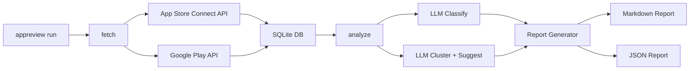

# appreview-insight

[](https://github.com/<owner>/appreview-insight/actions)
[](LICENSE)
[](https://www.python.org/)

**モバイルアプリのレビューを自動収集・分析・改善提案するOSS CLIツール。**

App Store Connect API と Google Play Developer API からレビューを取得し、LLM（OpenAI / Anthropic / Ollama）で不満カテゴリへ自動分類、Markdownレポートと改善提案を生成します。

---

## 機能

- 🍎 **App Store Connect API** — JWT認証、ページネーション、差分取得
- 🤖 **Google Play Developer API** — Service Account認証、トークンバケット制限遵守
- 🧠 **LLM分析** — OpenAI / Anthropic / Ollama 対応。分類・クラスタリング・改善提案を自動生成
- 🔒 **PIIマスキング** — LLMへ送信前にメール/電話番号/クレカ番号を自動マスク
- 📊 **Markdownレポート** — バージョントレンド・Top Issues・改善提案付き
- 💾 **差分実行** — SQLiteに既取得IDを記録。冪等に実行可能
- 💰 **コスト見積もり** — 実行前に推定費用を表示。上限超過時は確認プロンプト

---

## 5分で始めるQuickstart

### 1. インストール

```bash
pip install appreview-insight
```

ローカル開発の場合:

```bash
git clone https://github.com/<owner>/appreview-insight
cd appreview-insight
pip install -e ".[dev]"
```

### 2. 対話的セットアップ

```bash
appreview init
```

質問に答えると `appreview.yaml` と `.env` が生成されます。

### 3. 認証情報を設定

`.env` ファイルを編集:

```env
APP_STORE_ISSUER_ID=xxxx-xxxx-xxxx-xxxx-xxxx
APP_STORE_KEY_ID=XXXXXXXXXX
APP_STORE_PRIVATE_KEY_PATH=./secrets/AuthKey_XXXXXXXXXX.p8
GOOGLE_PLAY_SERVICE_ACCOUNT_JSON=./secrets/service-account.json
OPENAI_API_KEY=sk-...
```

設定方法の詳細:
- [App Store APIキーの取得方法](docs/setup-app-store.md)
- [Google Play Service Accountの設定](docs/setup-google-play.md)
- [App ID / Package Nameの確認方法](docs/how-to-find-app-id.md)

### 4. 接続確認

```bash
appreview doctor
```

### 5. レビュー取得・分析・レポート生成

```bash
appreview run --since 7d
```

`./reports/` に Markdown と JSON のレポートが生成されます。

---

## アーキテクチャ



---

## CLIコマンドリファレンス

| コマンド | 説明 |
|---------|------|
| `appreview init` | 対話的セットアップ |
| `appreview doctor` | 認証情報・接続確認 |
| `appreview fetch [--app NAME] [--since 7d]` | レビュー取得のみ |
| `appreview analyze [--run-id ID]` | 既存データの分析のみ |
| `appreview run [--app NAME] [--since 7d] [-y]` | フルパイプライン |
| `appreview report --run-id ID [--format md\|json]` | レポート再生成 |
| `appreview cost-estimate` | コスト見積もり |
| `appreview list-runs` | 実行履歴一覧 |

共通オプション: `--config PATH`, `--verbose / -v`, `--quiet / -q`, `--dry-run`, `--version`

---

## LLMプロバイダの使い分け

| プロバイダ | コスト | プライバシー | 速度 | 推奨用途 |
|-----------|--------|------------|------|---------|
| `openai` (gpt-4o-mini) | 低 | データ送信あり | 速い | 日常的な分析 |
| `openai` (gpt-4o) | 中 | データ送信あり | 速い | 精度重視の改善提案 |
| `anthropic` (claude-3-5-haiku) | 低 | データ送信あり | 速い | 代替プロバイダ |
| `ollama` | 無料 | **ローカル完結** | モデル依存 | プライバシー最優先 |

Ollamaはネットワーク外部へのデータ送信なし。詳細は [Ollama設定](#ollama-の使い方) を参照。

### Ollamaの使い方

```bash
# Ollamaをインストール・起動
ollama serve
ollama pull llama3

# appreview.yaml で設定
# llm:
#   provider: ollama
#   classification_model: llama3
#   suggestion_model: llama3
```

---

## 設定リファレンス

完全な設定例は [appreview.example.yaml](appreview.example.yaml) を参照してください。

### 主要設定項目

| 設定 | デフォルト | 説明 |
|------|----------|------|
| `llm.max_cost_usd_per_run` | 5.00 | 1回の実行コスト上限 |
| `analysis.min_reviews_for_cluster` | 3 | クラスタ化の最小件数 |
| `analysis.pii_masking` | true | LLM送信前のPIIマスク |
| `storage.anonymize_reviewers` | false | レビュアー名の匿名化 |
| `fetch.since_days` | 7 | デフォルト取得期間（日） |

---

## Google Playの重要な制約

Google Play Developer APIは**過去7日分のレビューしか返しません**。データの欠損を防ぐため、**日次実行を強く推奨します**。

```bash
# cronの例（毎日朝9時）
0 9 * * * cd /path/to/project && appreview run --quiet
```

---

## プロンプトのカスタマイズ

分類カテゴリや分析方針をカスタマイズする方法は [docs/prompt-customization.md](docs/prompt-customization.md) を参照してください。

---

## 貢献ガイド

1. Fork → `genspark_ai_developer` ブランチでの作業を推奨
2. `pytest` を全パスさせてからPR
3. Conventional Commits形式でコミット
4. `DECISIONS.md` に設計判断を記録

---

## ライセンス

MIT License — 詳細は [LICENSE](LICENSE) を参照。
